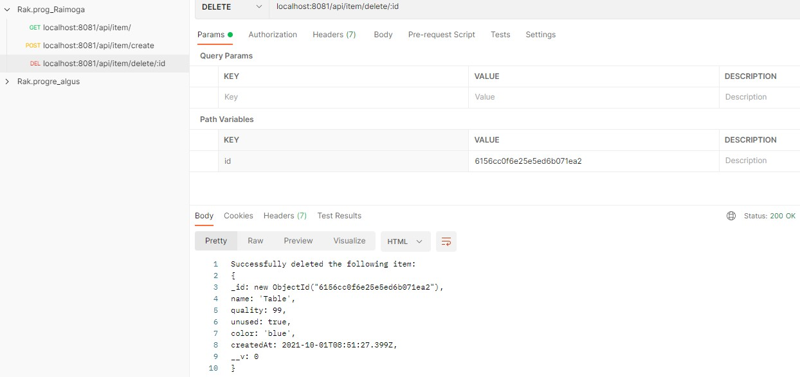
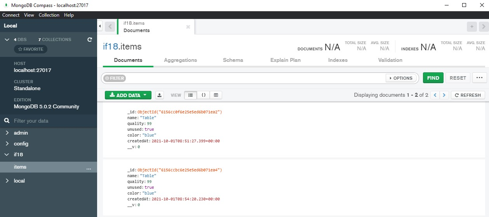

## Lokaalne setup

- Navigeeri kausta `local-dev`
- Installi vajalikud dependency'd
```
docker-compose run --rm --no-deps backend-node install
docker-compose run --rm --no-deps frontend-react install
```
- Kui vaja kustuta vanad samanimelised konteinerid
```
docker rm frontend-react
```
- Seejärel käivita kõik teenused (headless)
```
docker-compose up -d
```
- Rakendused on kättesaadavad

- Selleks, et peatada kõik teenused
```
docker-compose stop
```

Frontend react - http://localhost:3000/

Backend node - http://localhost:8081/

## Troubleshoot

- Probleemi ilmnemisel võid vaadata, kas probleem Dockeris ja reinstallida see
- Kustutada node_modules kaust mõlemast folderist ja installida need ülemiste käskudega uuesti

## Tehtud päringud  
Päringud Postman'i abil:  
  
Mongo vaade:  
  