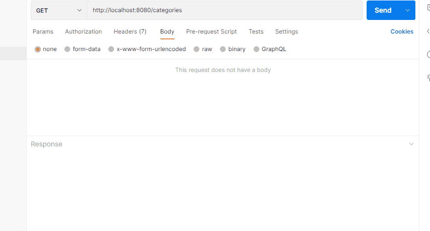
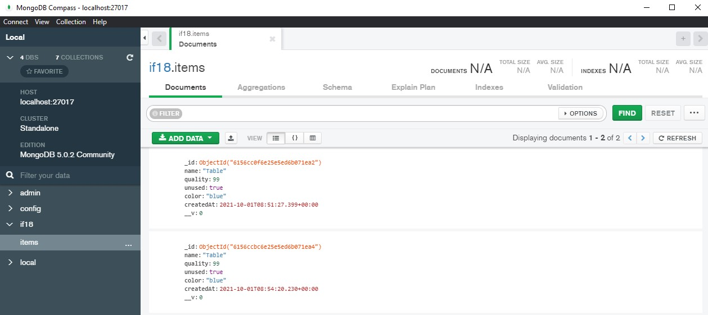

## 1. kodutöö
Uue kategooria lisamine toimib Backendis. Testitud Postman'iga.  
  

## 2. kodutöö
"Kategooriad" nupp asub avalehel (mitte navbar-il). Sealt avaneb kategooriate leht, kus kuvatakse juba sisestatud kategooriaid ja nuppu, mille abil on võimalik minna "Lisa uus kategooria" lehele.  
  

## 01.10.2021 tunnitöö  
Päringud Postman'i abil:  
  
Mongo vaade:  
 
