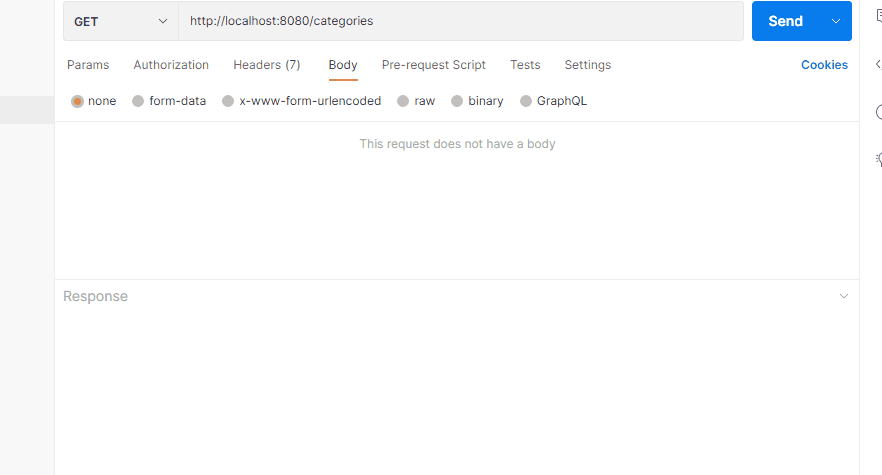
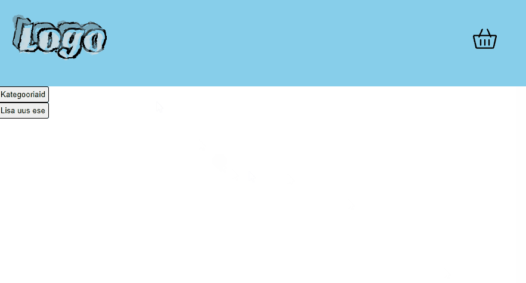
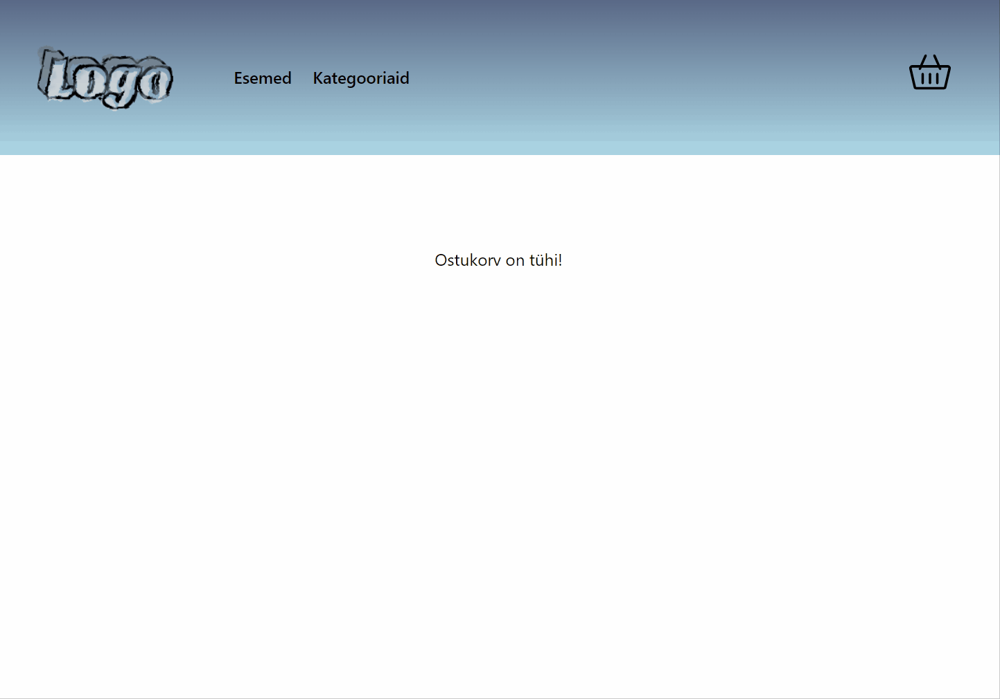
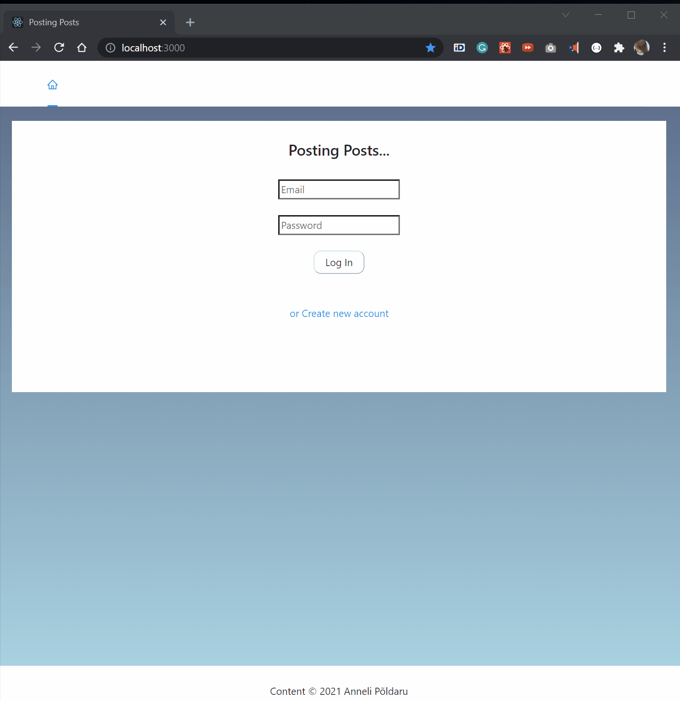
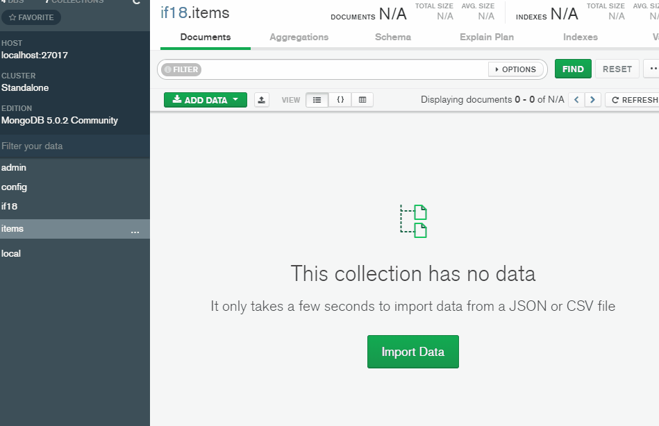

## Siin README failis on tehtud tööde GIF-animatsioonid.  
<strong><em>(Click the arrow to expand)</em></strong>  
  
# Kodutööd  

  
1. kodutöö

  
  Uue kategooria lisamine toimib Backendis. Testitud Postman'iga.  
  
    
  

  

  
2. kodutöö

  
  "Kategooriad" nupp asub avalehel (mitte navbar-il). Sealt avaneb kategooriate leht, kus kuvatakse juba sisestatud kategooriaid ja nuppu, mille abil on võimalik minna "Lisa uus kategooria" lehele.  
  
  
  

  

  
3. kodutöö

  ### I osa:
  * lisasin eseme info uuendamise võimaluse  
  * lisasin eseme quality väärtuse 1 võrra kasvatamise võimaluse  
  * lisasin kõikide esemete korraga kustutamise võimaluse  
  * ja eseme mudelis on timestamp, mis tekitab createdAt ja updatedAt väljad  
  * updatedAt väli uueneb automaatselt iga kord, kui eseme infot uuendatakse  

    

  ### II osa:
  * lisasin uue komponendi - Farewell  
  * katsetasin Conditional renderingi. Nii ternary operator-i, kui ka short-circuit operaatoriga.  
  * Magic Number-i näitamise/peitmise nupul muutub ka tekst  

    

  
4. kodutöö

  
  ### I osa:
  * Lisasin komponentidele ja lehekülgedele natukene style'i.  
  
    
  
  ### II osa:
  * Kuna 25.10 loengus lisandunud elemendid tegid olemasoleva kujunduse natukene katki, siis täiendasin seda veidi. Veebilehel on nüüd ka väiksematele ekraanidele sobiv dropdown-itav navbar:  

    

  * Lisasin ka "loading" komponendi, mis on nähtav ainult siis, kui lehe sisu veel laetakse. Et see paremini välja paistaks siis simuleerisin aeglast võrguühendust:  

    

  * Kuulutuste kaste kuvatakse nüüd grid vaates. Nii õnnestus tekitada layout, mil viimases reas olevad üksikud kuulutused paiknevad ikka rea alguses (mitte keskel).  

    

  * Ning nuppudel on hover efekt küljes.  

    

  
5. kodutöö

  
  Sign Up, Log In, Log Out operations. Deleting and adding a post + show all the posts in one table.  
  When I have more free time, I'll try to finish the tasks (I wrote comments about them).  
  
    
  

 
  
# Tunnitööd  
  
  

  
01.10.2021 tunnitöö  

  
  Päringud Postman'i abil. Mongo andmebaas:  
  
    
  

  

  
04.10.2021 tunnitöö

  
  Animatsioonis on 3 osa. Alustuseks on näha päringud Postmani peal. Seejärel katsetasin ka Swaggerit. Ning lõpetuseks on näha mis vaatas vastu PostgreSQL andmebaasist.  
  
    

  
15.10.2021 tunnitöö

  
  JWT authorization. Testisime Postmaniga kasutaja loomist, sisselogimist ja Bearer Tokeniga lehele juurdepääsu saamist.
  
    

  
25.10.2021 tunnitöö

  
  Lisasime kuulutuse muutmise ja kustutamise võimaluse (Admini vaates). Ning ühe kuulutuse vaatamise võimaluse.
  
    

 
  
### Pisipildid, logod, animatsioonid jms on võetud järgnevatelt lehtedelt:  
* https://www.flaticon.com/  
* https://maketext.io/  
* https://loading.io/css  
* https://favicon.io/  