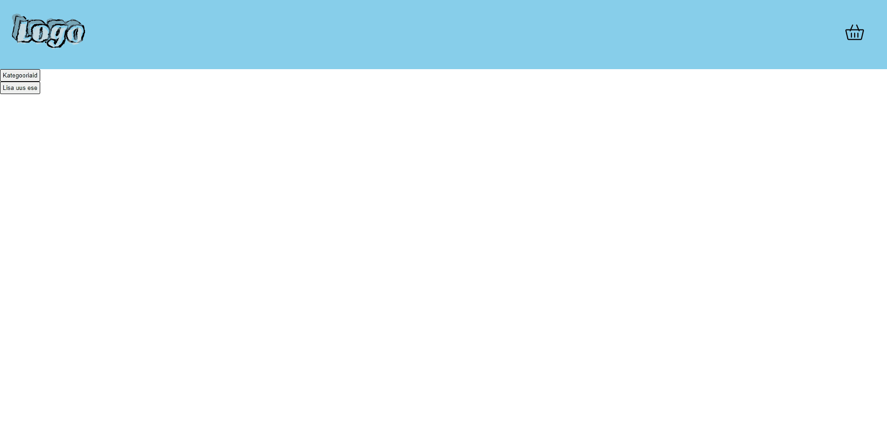

## 2. kodutöö
"Kategooriad" nupp asub pealehel (mitte navbar-il). Sealt avaneb sisestatud kategooriate vaade ja nupp, mille abil on võimalik minna "uue kategooria sisestamise" lehele.  

### 2. kodutöö animatsioon  

## 01.10.2021 tunnitöö  
Päringud Postman'i abil:  
  
Mongo vaade:  
 
